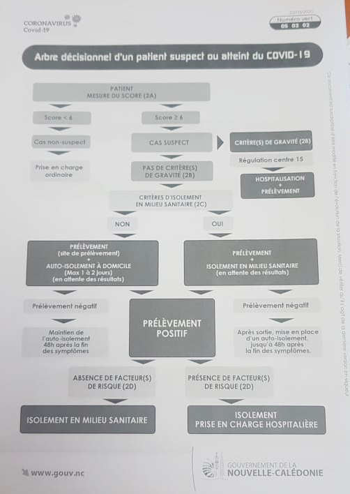

# COVIDiag.nc
Application d'orientation des malades en fonction de leurs symptômes lors de l'épidémie de COVID-19 en Nouvelle-Calédonie. L'application est accessible ici : [https://covidiagnc.web.app/](https://covidiagnc.web.app/)

Projet généré via [Angular CLI](https://github.com/angular/angular-cli) version 8.3.8.

# Sommaire
- [Règles métier](#règles-métier)
  - [Idée de départ](#idée-de-départ)
  - [Objectif](#objectif)
  - [Diagramme de décision](#diagramme-de-décision)
    - [Mode par points](#mode-par-points)
    - [Mode par catégorie](#mode-par-catégorie)
  - [Annexes](#annexes)
- [Développement](#développement)

# Règles métier

## Idée de départ 

Mettre en place une appli web pour diagnostiquer les signes de COVID-19 (ou non) en NC et orienter les gens en fonction des réponses vers leur médecin, un numéro local près de chez eux ou le 15.

## Objectif 

Eviter un engorgement du 15 et du Médipôle pour des cas non prioritaires/états grippaux classiques

## Diagramme de décision

2 modes de décision sont actuellement possibles : le mode **par points** et le mode **par catégorie**.

> NB : Le mode actuel de l'application est le mode **par points** (appliqué actuellement par le gouvernent de Nouvelle-Calédonie)

### Mode par points

En fonction de la gravité, chaque question a un nombre de points qui lui est attribué. Si la réponse à la question est **Oui**, les points sont additionnés. 

**Pour déterminer la recommandation, les règles suivantes s'appliquent :**

> NB : Les documents du Gouvernement de Nouvelle-Calédonie en [annexes](#formulaire-gouv-nc) ont été utilisés pour déterminer ces décisions. 

### Mode par catégorie 

On part du postulat de départ que les réponses aux différentes questions sont classées dans 3 catégories différentes :

- Signes cliniques
- Signes de gravité
- Facteurs de risque

> NB : Ce diagramme est en cours d'élaboration et n'a pas été à ce jour validé par les services sanitaires de Nouvelle-Calédonie. Son utilisation n'est donc pour le moment pas applicable.

## Annexes
### Formulaire Gouv NC
#### Points par questions

#### Diagramme de décision
> NB : L'application s'arrête actuellement au bloc de décision "PAS DE CRITERE(S) DE GRAVITE (2B)", la suite étant gérée par téléphone.

#### Catégories de questions

# Développement

## Lancement local

1. Lancer `npm install` pour installer les packages node nécessaires
2. Lancer `npm start` pour démarrer l'application
3. Naviguer vers `http://localhost:4200/`

> NB : L'application se rafraichira ensuite automatiquement à chaque modification d'une des sources (hors config)

## Build

### Build local 
Lancer `ng build` pour compiler le projet. Les fichiers compilés sont stockés dans le répertoire `dist/`.

### Build avant déploiement 
Lancer `ng build --prod` si l'objectif est de déployer sur un serveur distant.

## Déploiement Firebase

1. Lancer `ng build --prod` pour effectuer un build de déploiement
2. Lancer `firebase deploy`
3. L'application déployée est ensuite accessible sur [https://covidiagnc.web.app/](https://covidiagnc.web.app/)

> NB : La configuration est dans le fichier [firebase.json](firebase.json).

## Tests unitaires

> NB : Non applicable pour l'instant

Run `ng test` to execute the unit tests via [Karma](https://karma-runner.github.io).

## Tests end-to-end

> NB : Non applicable pour l'instant

Run `ng e2e` to execute the end-to-end tests via [Protractor](http://www.protractortest.org/).
