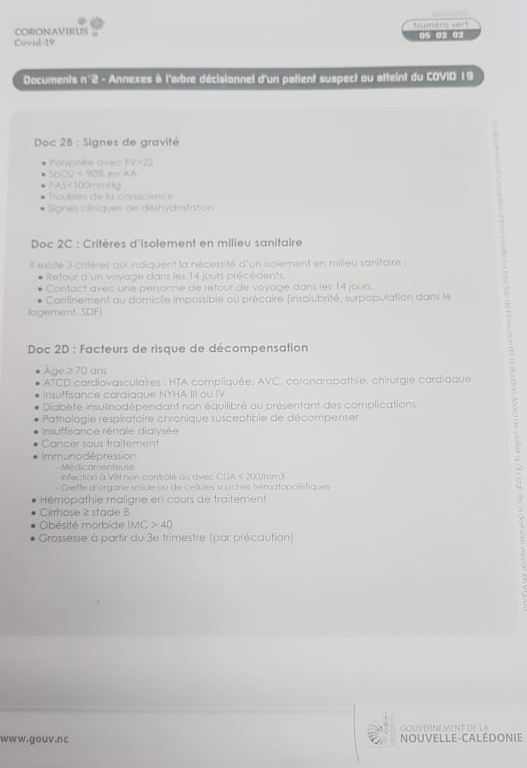

# COVIDiag.nc
Application d'orientation des malades en fonction de leurs symptômes lors de l'épidémie de COVID-19 en Nouvelle-Calédonie. L'application est accessible ici : [https://covidiagnc.web.app/](https://covidiagnc.web.app/)

Projet généré via [Angular CLI](https://github.com/angular/angular-cli) version 8.3.8.

# Règles métier

## Idée de départ 

Mettre en place une appli web pour diagnostiquer les signes de COVID-19 (ou non) en NC et orienter les gens en fonction des réponses vers leur médecin, un numéro local près de chez eux ou le 15.

## Objectif 

Eviter un engorgement du 15 et du Médipôle pour des cas non prioritaires/états grippaux classiques

## Diagramme de décision

2 modes de décision sont actuellement possibles : le mode **par score** et le mode **par catégorie**.

### Mode par score

En fonction de la gravité, chaque question a un nombre de points qui lui est attribué. Si la réponse à cette question est **Oui**, les points sont additionnés. 

**A la fin, le diagramme ci-dessous s'applique.**

#### Points / Questions

#### Diagramme de décision

#### Catégories de questions

### Mode par catégorie 

On part du postulat de départ que les réponses aux différentes questions sont classées dans 3 catégories différentes :

- Signes de gravité
- Facteurs de risque
- Symptômes classiques

Si le patient réponds à au moins 1 des questions présente dans une catégorie, le cas "Oui" du diagramme ci-dessous s'applique :

NB : Ce diagramme est en cours d'élaboration/validation par le corp médical. Il sera régulièrement mis à jour.

# Développement

## Lancement local

1. Lancer `npm install` pour installer les packages node nécessaires
2. Lancer `npm start` pour démarrer l'application
3. Naviguer vers `http://localhost:4200/`

NB : L'application se rafraichira ensuite automatiquement à chaque modification d'une des sources (hors config)

## Build

### Build local 
Lancer `ng build` pour compiler le projet. Les fichiers compilés sont stockés dans le répertoire `dist/`.

### Build avant déploiement 
Lancer `ng build --prod` si l'objectif est de déployer sur un serveur distant.

## Déploiement Firebase

1. Lancer `ng build --prod` pour effectuer un build de déploiement
2. Lancer `firebase deploy`
3. L'application déployée est ensuite accessible sur [https://covidiagnc.web.app/](https://covidiagnc.web.app/)

NB : La configuration est dans le fichier [firebase.json](firebase.json).

## Tests unitaires

NB : N/A pour l'instant

Run `ng test` to execute the unit tests via [Karma](https://karma-runner.github.io).

## Running end-to-end tests

NB : N/A pour l'instant

Run `ng e2e` to execute the end-to-end tests via [Protractor](http://www.protractortest.org/).
